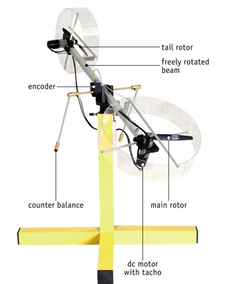
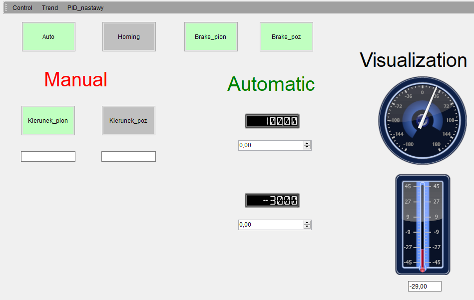
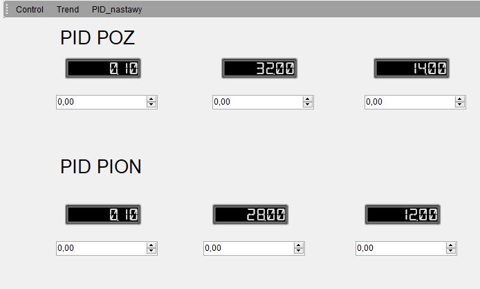
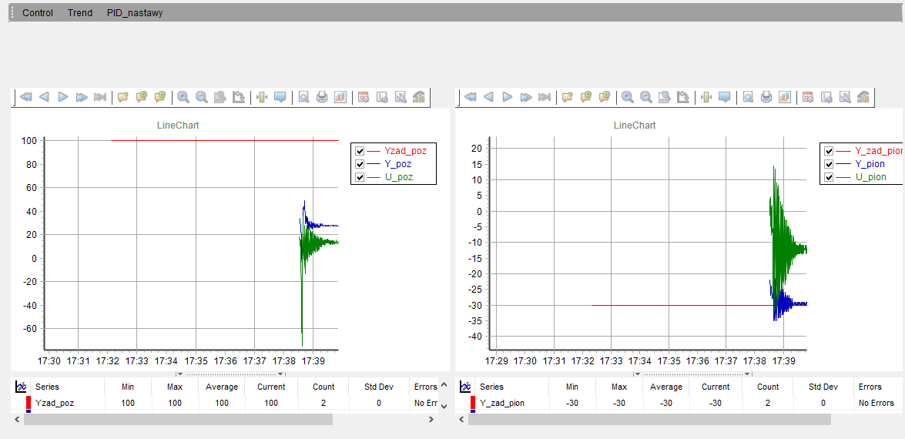

# PLC & SCADA Control: 2-DOF Helicopter (TRAS)

## 📌 O projekcie
Projekt systemu SCADA oraz układu sterowania zrealizowany dla dwuwirnikowego modelu helikoptera (TRAS - Twin Rotor Aerodynamical System). Celem projektu było stworzenie wieloekranowego interfejsu nadzoru i wizualizacji, umożliwiającego zarządzanie procesem, diagnostykę oraz strojenie regulatorów w czasie rzeczywistym.

Warstwa sterowania (algorytmy PID) została zaimplementowana na przemysłowym sterowniku PLC z wykorzystaniem języka Structured Text (ST), wraz z  konfiguracją sprzętowej części stanowiska badawczego, obejmująca m.in. obsługę szybkich liczników oraz generację sygnałów PWM w środowisku GX Works 3.

  
   
  <em>(Obiekt badawczy: model helikoptera o dwóch stopniach swobody - oś pionowa i pozioma).</em>

## 🛠️ Wykorzystane Technologie
* **System wizualizacji i akwizycji danych:** SCADA MAPS – realizacja interfejsu graficznego, logiki operatorskiej i wizualizacji trendów.
* **Sterowanie:** PLC MELSEC FX5U (Mitsubishi).
* **Oprogramowanie PLC:** GX Works 3 (język ST).
* **Sensoryka:** Szybkie liczniki sprzętowe odczytujące enkodery (rozdzielczość fizyczna: 1024 impulsy/obrót), sygnały PWM wysokiej częstotliwości (5-15 kHz) oraz sygnały analogowe ±10 V z tachoprądnic.

---

## 🖥️ System Nadzoru i Wizualizacji (SCADA MAPS)

Projekt obejmuje interaktywny system zapewniający dwukierunkową komunikację z procesem. Interfejs podzielono na 3 widoki:

### 1. Główny Panel Operatorski (Control)
Główne centrum nadzoru nad obiektem. Ekran ten umożliwia przełączanie trybu pracy (Auto/Manual), wykonanie procedury bazowania (Homing) oraz natychmiastowe aktywowanie hamulców dla każdej z osi (`brake_pion`, `brake_poz`). Panel zawiera cyfrowe wskaźniki pozycji, pola do wprowadzania wartości referencyjnych dla trybu automatycznego, a także zadajniki do ręcznego sterowania wypełnieniem sygnału PWM.

### 2. Panel Nastaw (PID_nastawy)
Interfejs inżynierski przeznaczony do strojenia obiektu w czasie rzeczywistym. Umożliwia modyfikację nastaw regulatorów: wzmocnienia (K), czasu całkowania (Ti) oraz czasu różniczkowania (Td) niezależnie dla osi pionowej i poziomej. Rozwiązanie to pozwala na optymalizację układu bez konieczności rekonfiguracji kodu źródłowego na sterowniku PLC.

### 3. Analiza Trendów i Diagnostyka (Trend)
Panel prezentujący bieżące przebiegi najważniejszych zmiennych procesowych. Wykresy obrazują zależności między wartością zadaną (SV), wartością rzeczywistą (PV) oraz sygnałem sterującym (MV) dla obu osi helikoptera. Moduł ten ułatwia analizę dynamiki układu i ocenę poprawności działania regulatorów PID.

---

## ⚙️ Warstwa Sterowania (PLC / Structured Text)

W celu realizacji zadań sterowania, w kodzie ST zaimplementowano mechanizmy zapewniające poprawną pracę algorytmów regulacji:
* **Blok Regulatora `S_PIDR`:** Do obliczeń wykorzystano blok funkcyjny implementujący równania różnicowe regulatora PID na zmiennych typu `FLOAT`. Zastosowanie tego formatu pozwoliło na rozszerzenie sygnału sterującego na zakres [-100, 100], co umożliwia jednoczesne sterowanie prędkością (PWM) i kierunkiem obrotu silników (wyjścia Y3, Y5). 
* **Zarządzanie trybami pracy (Auto/Manual):** Wdrożono logikę przełączania trybów sterowania, powiązaną bezpośrednio z panelem SCADA. Przy przejściu w tryb ręczny, zmienna `Control_ON` blokuje działanie regulatorów wewnątrz sterownika.
* **Skalowanie i ograniczenia:** Algorytm na bieżąco przelicza wartości kątowe wprowadzane w systemie SCADA (0-90°) na liczbę impulsów z enkoderów (0-1024). Wprowadzono również warunek odcięcia sygnału PWM (M500 := FALSE), gdy wartość wysterowania spada poniżej 1%.

---

## 🚁 Konfiguracja sprzętowa procesu

W celu prawidłowej integracji systemu sterowania z obiektem fizycznym wdrożono następującą konfigurację sprzętową:
* **Akwizycja pozycji:** Sprzętowy odczyt z enkoderów inkrementalnych (wejścia X0-X3) do 32-bitowych rejestrów PLC (SD4500, SD4530).
* **Obsługa PWM:** Konfiguracja sprzętowych wyjść sterownika (Y0, Y1) do generowania sygnału PWM sterującego układami wykonawczymi.
* **Bezpieczeństwo i Bazowanie:** Przypisanie wyjść cyfrowych Y2 i Y4 do hamulców osi oraz wykorzystanie instrukcji `DHCMOVP` do sprzętowego zerowania liczników .

---
*Uwaga: Blok algorytmu `S_PIDR` stanowi klasę z zewnętrznej biblioteki wykorzystywaną na stanowisku laboratoryjnym.*

---
*Pliki źródłowe z implementacją logiki w języku ST dostępne są w folderze `src/`.

**Sprawozdanie z projektu** (wraz ze screenami deklaracji zmiennych globalnych oraz lokalnych) dostępne jest w folderze `docs/`.*

## 📄 Licencja
Projekt ma charakter edukacyjny. Kod źródłowy udostępniany jest na licencji MIT.

## 👥 Autorzy
* **Dominik Bijoch**
* **Michał Dobrowolski**
* **Mateusz Sosnowski**

---
Projekt zespołowy został zrealizowany w ramach zajęć laboratoryjnych z przedmiotu **Systemy automatyki DCS i SCADA (DCS)** na Politechnice Warszawskiej (WEITI), semestr 25L.